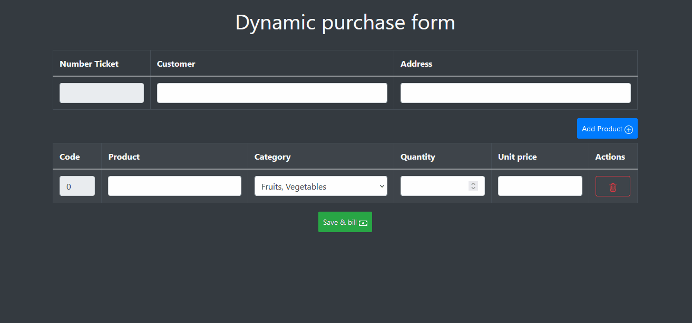

# PURCHASE FORM 💲✅
Make your bill, insert many products with its details and process the bill and generate the final ticket, that include the data about your customer.



<hr>

## Installation ⬇️ 

**Requirements👮🏻‍♂️**

You need to have installed in your computer a Local Server Program, like XAMPP. 
To run the PHP files.

**Steps🚶🏻‍♂️**
1. Download the code in your computer and extract the .ZIP 💻
2. Put the folder´s code in htdocs' folder from XAMPP ✅
3. Start XAMPP and go to your browser ⚛️
4. Insert the next ULR: 
```
http://localhost/facturacionproductos/
```

Now, you'll could to watch the Purchase form and can star to use it.

<hr>

## Workflow ▶️🔄

When you put the customer name, the system automatically adds a random number for the ticket.
Add the customer's address, is just additional info.
Now, you can to insert the product what customer will buy. You can to add all products that you want.
If you want to delete a product, or many products, you can do it. Just click the trash button on the right side, and delete it.
And when all your products are inserted. Click the button "Save and bill" and take your bill on the table below.
Refresh the page to create a new bill. (I'll do a 'clear form button' in the next update).

<hr>

## Story about project📖 

This purchase for was an exam of my university, made with the basic web tools. HTML and JavaScript. Also, we added bootstrap for the view. I did to use that because, at that moment, it was faster than use CSS only.
In the classroom, we only did have two hours to do the exam. I did get 10/10 🥳🍾 
